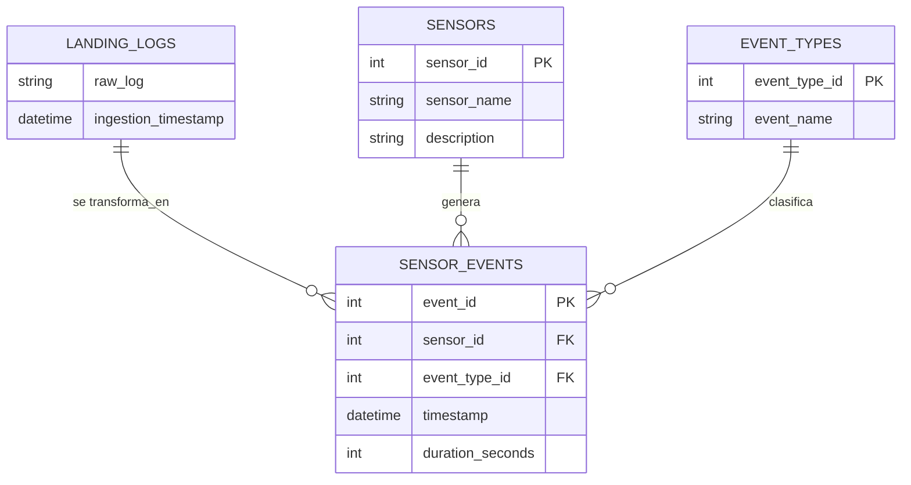

# Enunciado
Hola ingeniero 👋. Bienvenido a tu septimo desafio! Ya sabes que en [Vault-Tec Corporation](https://fallout.fandom.com/es/wiki/Vault-Tec_Corporation) tenemos sensores encargados de monitorear las condiciones actuales de nuestros refugios. En ocasiones pasadas detectamos que varios de ellos presentaban fallas recurrentes, impidiendo que pudieramos determinar las condiciones de nuestros bóvedas y darle la seguridad esperada a nuestros clientes en un mundo post apocaliptico 🙃. 

Anteriormente, migramos la responsabilidad de transformar los datos dados por los sensores del pipeline en Python a la base de datos -- descubre por que tomamos esta decision [AQUI](https://github.com/spuerta10/HenryLectures/tree/main/IntroSQL/homework#un-poco-de-teoria) --. Para ello creamos la base de datos sensors_logs_db y las tablas landing_logs, sensors, event_types, sensor_events con la siguiente estructura.

# Tu turno!
Ahora migremos del pipeline en Python a la base de datos los metodos encargados de analizar los fallos de los sensores: `get_sensor_failure_duration`, `get_weekly_sensor_failure_duration`, `get_weekly_sensor_failure_probability` y `get_conditional_failure_probability`. Esto lo podras lograr haciendo uso de [procedimientos almacenados](https://www.w3schools.com/sql/sql_stored_procedures.asp), mas conocidos como stored procedures (SP).

**IMPORTANTE:** Recuerda implementar las validaciones respectivas. Un ejemplo de estas seria validar que el sensor dado si exista.

# 1. Pre-requisito
Ten presente que para realizar esta tarea tienes que tener activa la base de datos sensors_logs_db y pobladas las tablas sensors, event_types y sensor_events. En la carpeta [src/db/scripts](https://github.com/spuerta10/HenryLectures/tree/main/ConsultasCompuestasYGestionBD/src/db/scripts) tienes scripts de SQL que realizan las tareas mencionadas para el motor de bases de datos **PostgreSQL**. 

# 2. Crea un script SQL
Crea un script SQL para almacenar la creacion de los procedimientos almacenados requeridos. 

# 3. Implementa los procedimientos almacenados
En el archivo creado implementa los procedimientos almacenados mencionados.
