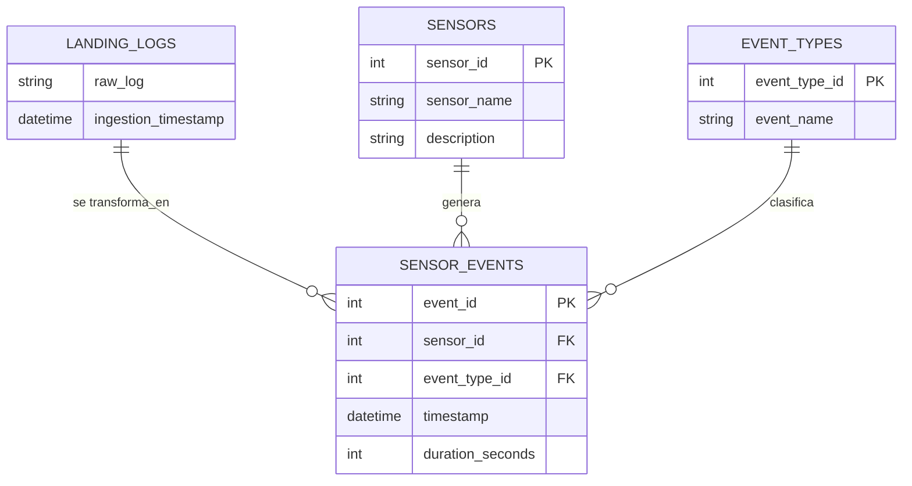

# Enunciado
Hola ingeniero 👋. Bienvenido a tu sexto desafio! Ya sabes que en [Vault-Tec Corporation](https://fallout.fandom.com/es/wiki/Vault-Tec_Corporation) tenemos sensores encargados de monitorear las condiciones actuales de nuestros refugios. En ocasiones pasadas detectamos que varios de ellos presentaban fallas recurrentes, impidiendo que pudieramos determinar las condiciones de nuestros bóvedas y darle la seguridad esperada a nuestros clientes en un mundo post apocaliptico 🙃. 

Anteriormente, a pedido de nuestro equipo, desarrollamos un pipeline de analisis de fallas de los sensores presentes en nuestros refugios, haciendo uso del lenguaje de programacion Python. Dicho pipeline se encarga de la extraccion, transformacion y analisis de los datos de los sensores almacenados en los logs, sin embargo, no es la unica forma de hacerlo.

## Un poco de teoria
Actualmente, le estamos dando toda la responsabilidad al pipeline, este es responsable de manejar todo el ciclo de vida del dato: 
1. Extrae la informacion del archivo JSON dado.
2. Realiza transformaciones para darles formato a estos logs.
3. Ejecuta los analisis correspondientes sobre la informacion.
4. Dado que no estamos almacenando los datos en ninguna otra fuente de informacion, desecha los datos formateados.

Darle toda las responsabilidad al pipeline de datos tiene algunos pros y contras -- conocidos como tradeoffs en el mundo de la ingenieria de software y datos --, vease la siguiente tabla.

| | |
|-|-|
| Pros | Contras |
| Tienes toda la logica en un solo lugar | Duplicidad de codigo: validaciones, limpiezas, transformaciones se repiten si otro pipeline necesita usar los mismos pasos. |
| Mantenimiento inicial sencillo: Todo esta en un solo lugar. | Escalabilidad limitada: Dificil de dividir o escalar partes particulares de la logica, es probable que la transformacion de los datos ocupe mas recursos que la ingesta.

Sin embargo, el principal problema que enfrentamos es de escalabilidad: a medida de que los datos crezcan, nuestro pipeline consumira mas recursos, y requerira a su vez que aumentemos sus recursos de computo. El inconveniente aqui es que existen plataformas mas optimizadas para este rol: los motores de bases de datos.

Algunos de los principales motivos para delegar la logica a la base de datos son:
- Escalabilidad → los motores de bases de datos paralelizan operaciones y distribuyen carga (ej. BigQuery, Snowflake).
- Eficiencia → evitas mover grandes volúmenes de datos fuera de la DB.
- Reutilización → vistas o tablas transformadas pueden ser consumidas por múltiples pipelines, evitando duplicidad de código.
- Mantenibilidad → la lógica de negocio queda centralizada en SQL, en lugar de replicarse en cada pipeline.

Con esto en mente, la alternativa es dejar que la base de datos se encarge de las transformaciones. Para ello se cargan los datos en crudo en una tabla o zona llamada landing, para posteriormente transformalos e insertarlos en las tablas adecuadas.

## Los recursos
Esta vez deberas de crear los siguientes recursos por medio de scripts de SQL y haciendo uso del motor de bases de datos de tu preferencia:

| | |
|-|-|
| Base de datos | sensors_logs_db |
| Tablas | landing_logs, sensors, event_types, sensor_events |

Las tablas se relacionan y contienen los siguientes campos:

# Tu turno! 
Ahora es tu turno! 

## 1. Escoge el motor de bases de datos a usar
Elige que motor de bases de datos quieres usar.

## 2. Crea la base de datos
Crea un script SQL y en el utiliza CREATE DATABASE para crea la base de datos `sensors_logs_db`.

## 3. Crea las tablas
Crea un nuevo script SQL y en el utiliza CREATE TABLE para crear cada una de las tablas solicitadas.

## 4. Carga la tabla landing
Crea un nuevo script SQL para poder cargar la tabla lading con la informacion contenida por el archivo [logs.jsonl](https://github.com/spuerta10/HenryLectures/blob/main/IntroSQL/data/logs.jsonl).

## 5. Transforma y carga los datos
Crea un nuevo script SQL para transformar y cargar las demas tablas con los datos con el formato adecuado.
